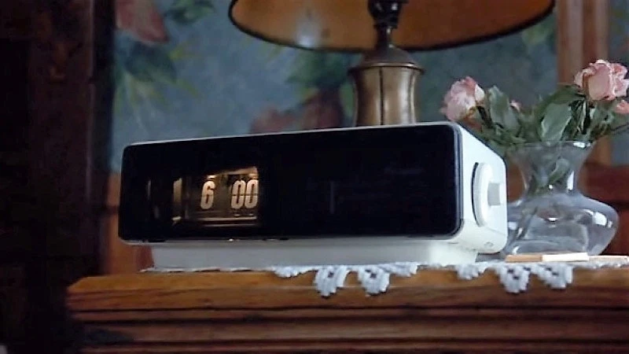

FlipClock
===========

Arduino based FlipClock style alarm clock
-------------------------------------------

This project aims to build a FlipClock style alarm clock (software emulated flips on a small screen) like the one used in the movie Groundhog Day, and play "I've got you babe" (or other sound clip).  
  
Initially  I'm borrowing code and information from HACKADAY.IO https://hackaday.io/project/167162-flipclock which already has the clock functionality using an Arduino Uno, a DS3231 Real Time Clock module and a shield based 3.5" TFT LCD display.  

The hackaday project almost completely uses all available space for extra functionality, so I will have to remove all the uneeded fancy alternate display modes, and add a JQ6500 mp3 player and a PAM8610 audio amp (or similar).  Alarm code will also need to added.
